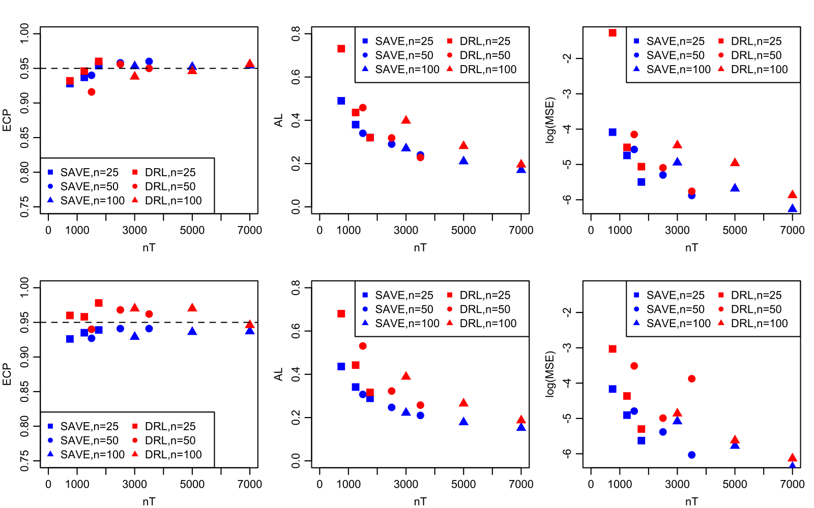
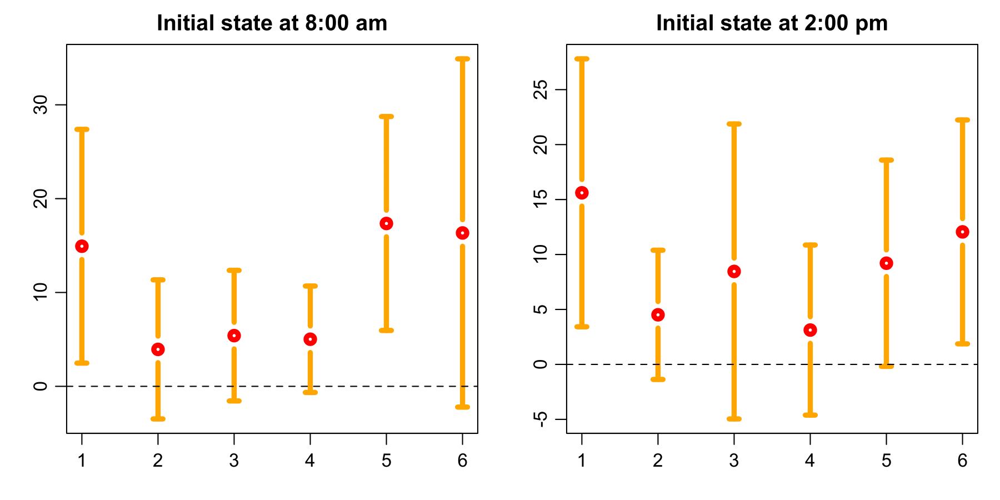

# Statistical Inference of the Value Function for Reinforcement Learning in Infinite Horizon Settings

This repository contains the implementation for the paper "Statistical Inference of the Value Function for Reinforcement Learning in Infinite Horizon Settings" in Python.

## Summary of the paper

Reinforcement learning is a general technique that allows an agent to learn an optimal policy and interact with an environment in sequential decision making problems. The goodness of a policy is measured by its value function starting from some initial state. The focus of this paper is to construct confidence intervals (CIs) for a policy’s value in infinite horizon settings where the number of decision points diverges to infinity. We provide inferential tools for

1. the value under a fixed policy in off-policy settings (Section 3.1);
2. the value under an unknown optimal policy in off-policy settings (Section 3.2);
3. the value under an unknown optimal policy in on-policy settings (Section 4);
4. difference between the value under an unknown optimal policy and that under the behavior policy (Appendix B.2).

For 1, we compare with the double reinforcement learning method (Kallus and Uehara, 2019) and find the proposed SAVE method achieve better finite sample performance (see below) in settings where parametric-rate estimation of the value is feasible.

For 2--4, we allow the setting to be nonregular where the optimal policy is not unique. We apply our method to a dataset from mobile health applications and find that reinforcement learning algorithms could help improve patient's health status. See the figure that depicts the CI of the value difference below.

## Requirement

+ Python3
    + sklearn==0.21.2 
    + gym ## for Cliffwalk experiment

## File Overview

+ src
    + AGENT.py : Main object for SAVE model
    + utility.py: utility functions
    + exp.py: Experiment for Value inference for fixed initial state under behavior policy (Not included in paper)
    + exp_int.py: Experiment for Value inference for integrated initial state under behavior policy
    + exp_est_pol.py: Experiment for Value inference for fixed initial state under estimated policy
    + exp_est_pol_int.py: Experiment for Value inference for integrated initial state under estimated policy
    
+ Ohio_data: source : http://smarthealth.cs.ohio.edu/OhioT1DM-dataset.html

+ cliffwalking_exp: experiment on cliffwalking

## How to Run the Files

### Experiment on Simulation:

`from src.exp_est_pol_int import *`

`main_get_value() # get true value by repetitions` 

`main()`

### Application to OhioT1DM:

`from src.exp_est_pol import *`

`main_realdata(patient = 0, reward_dicount = 0.5, S_init_time = 396)`

### Experiment on Cliffwalk:

The DRL is modified from [original code](https://github.com/CausalML/DoubleReinforcementLearningMDP.git) in `cliffwalking_exp/cw_notebook_ver_splitting.ipynb`

Our experiment is conducted in `cliffwalking_exp/SAVE_cliffwalking.ipynb`

    
